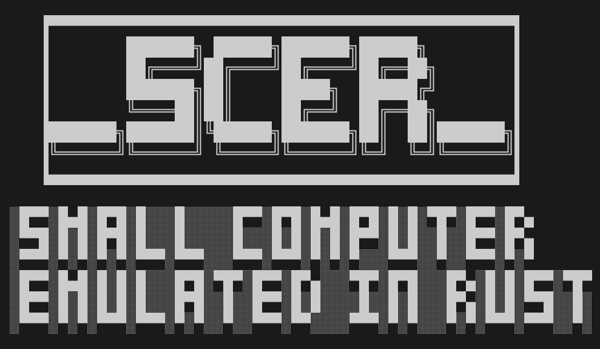
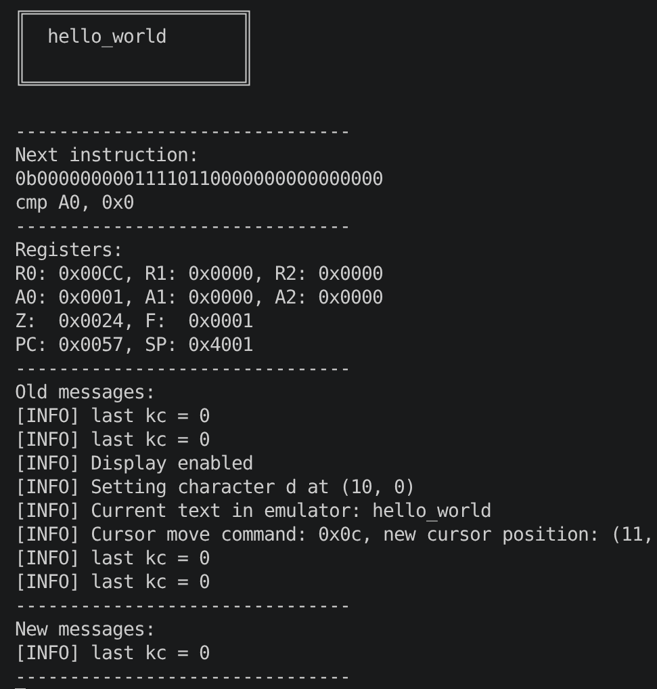

# SCER
Small Computer Emulated in Rust

SCER is a simple computer with 16 bit registers and 64 Kib of memory fully emulated in Rust. \
It features a custom instruction set that maps to 24 bit instructions. \
The crate comes with an assembler to compile instructions.

## Warning : work in progress

The project is far from finished. Some breaking changes WILL be made in the future. 

For more informations on what features are missing, see [TODO](#todo)

## Screenshots




## Overview
SCER includes two small CLI tools built with Cargo:

- `scer_assembler` — compiles `.sp` assembly files into binary `.csp` images.
- `scer_runner` — loads and executes `.csp` binaries in a terminal-emulated environment.

## Features

- 24-bit instruction encoding (3 bytes per instruction)
- 16-bit registers and 64 KiB address space (0x0000..=0xFFFF)
- Assembler with label and simple constant (`!name value`) preprocessing
- Peripheral bridge for simple IO mapping (display and keyboard examples)
- Example programs provided in the `programs/` folder

## Instruction Set (quick reference)

Arithmetic (dest, src, imm|reg):
- `add dest src imm|reg`
- `sub dest src imm|reg`
- `and dest src imm|reg`
- `or  dest src imm|reg`
- `xor dest src imm|reg`
- `asl dest src imm|reg`  (shift left)
- `asr dest src imm|reg`  (shift right)

Comparison:
- `cmp reg imm|reg`

Memory / Move:
- `lw reg address|reg`   (load word)
- `sw reg address|reg`   (store word)
- `mov reg imm`          (move immediate into register)

Stack / Control:
- `push reg|imm`
- `pop reg`
- `jeq label|imm`  (jump if zero flag set)
- `jlt label|imm`  (jump if negative flag NOT set)
- `jne label|imm`  (jump if zero flag NOT set)

Registers:
- `$r0`, `$r1`, `$r2`
- `$a0`, `$a1`, `$a2`
- `$z` (link/return register)
- `$f` (flags)

Immediate formats supported:
- Decimal: `42`
- Hex: `0x2A`
- Binary: `0b101010`
- Character literal: `'A` (note: single quote then char)

## Assembly syntax

- Comments start with `#`
- Labels begin with `@label`
- Defines use `!name value` and are replaced in preprocessing
- Empty and comment-only lines are ignored

## Examples included

- `programs/hello_world.sp` — writes text to the emulator display via memory-mapped IO
- `programs/fibonacci.sp` — computes Fibonacci sequence and writes results to memory
- `programs/kb_handler.sp` — (skeleton) keyboard/interrupt handler example
- `programs/parsing_test.sp` — tests for assembler parser

## Build & run

Build both tools:
```bash
cargo build --bin scer_assembler --bin scer_runner
```

Assemble an `.sp` file to `.csp` (default output path replaces `.sp` with `.csp`):
```bash
cargo run --bin scer_assembler -- programs/hello_world.sp
```

Run a compiled `.csp` program:
```bash
cargo run --bin scer_runner -- programs/hello_world.csp
```

Enable debug/step by step mode (runner accepts `-d`):
```bash
cargo run --bin scer_runner -- programs/hello_world.csp -d
```

## Runtime notes

- Machine memory layout reserves ranges for program, stack, heap, IVT, IO, and tests.
- Tests in `src/` use writing to a test end address (e.g. `0xFFFF`) to signal completion.

## Development notes

- Core files:
	- `src/program.rs` — assembler and instruction encodings
	- `src/machine.rs` — CPU, memory, peripheral bridge and execution
	- `src/emulator.rs` — terminal display and keyboard helper code
	- `src/scer_assembler.rs` — assembler CLI
	- `src/scer_runner.rs` — runner CLI

## Todo 

Main things to be done before SCER can be called a complete project

- Proper interrupt vector table to handle interrupts
- Keyboard support
- Switch the interface to CGI (see [the repo on github](https://github.com/Eloi-gg/cgi))
- At least one showcase program (probably a text editor and/or a minesweeper)